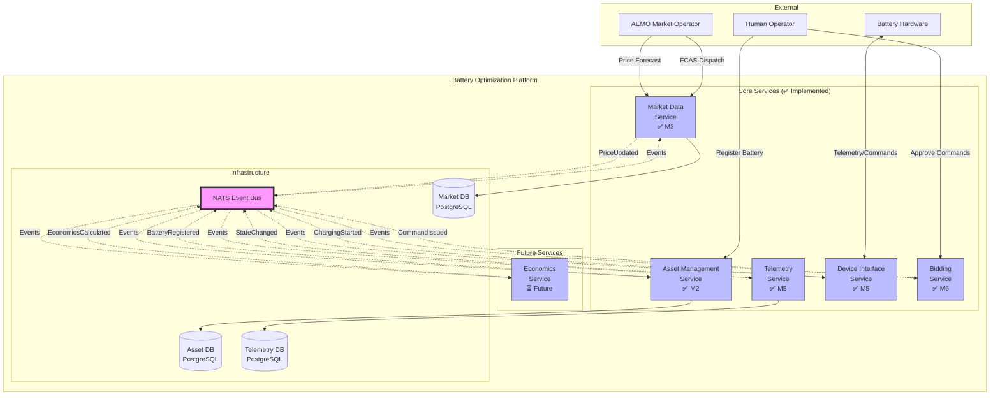
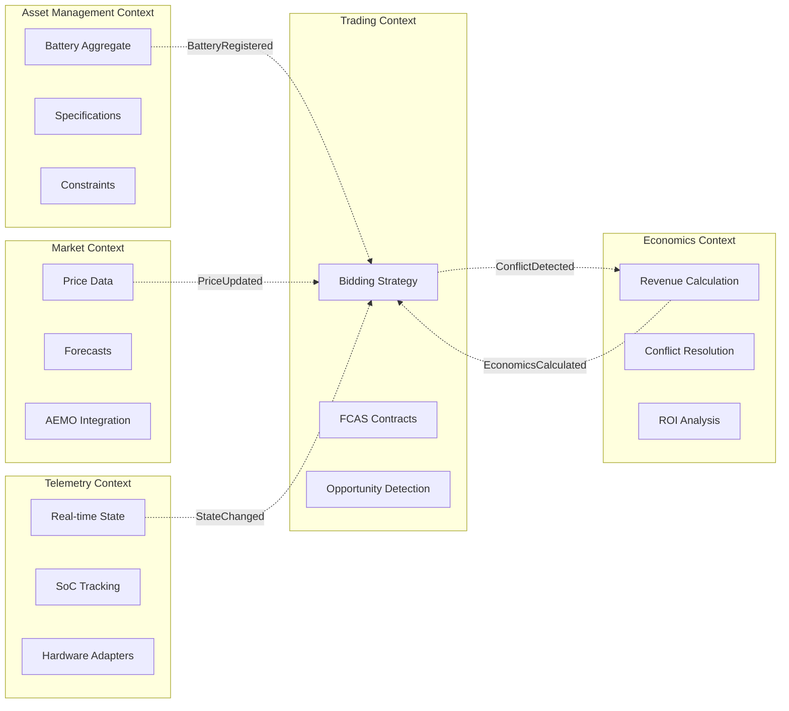
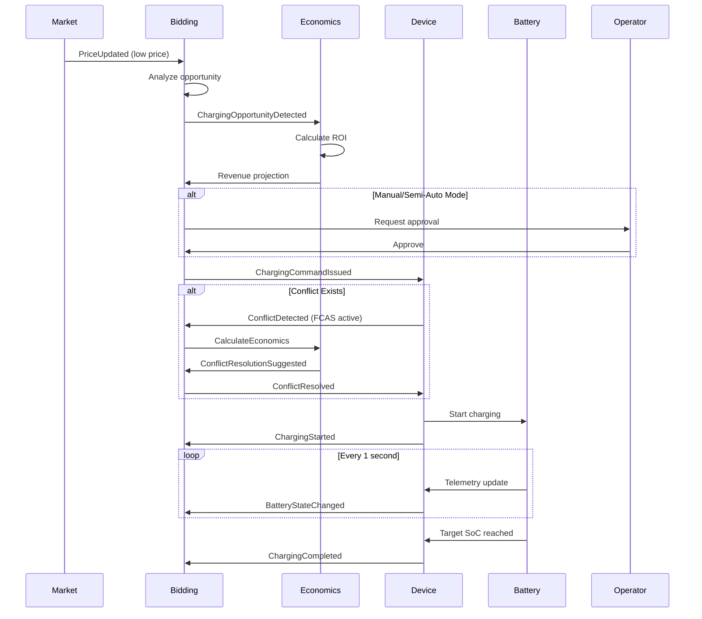
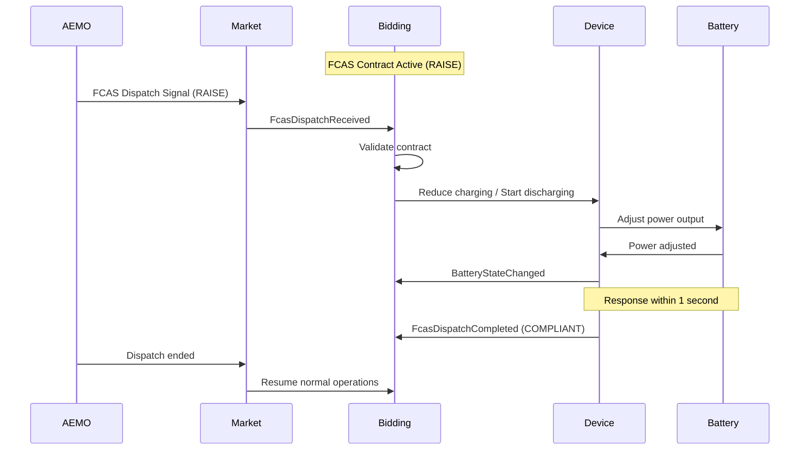
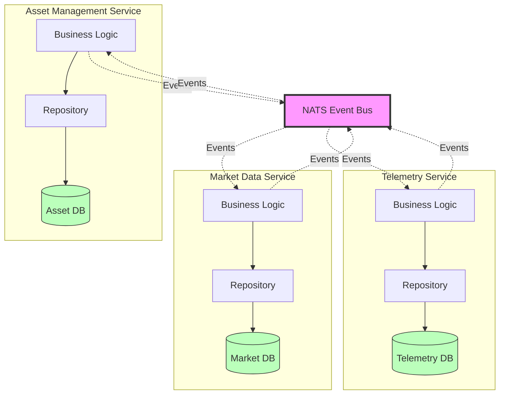
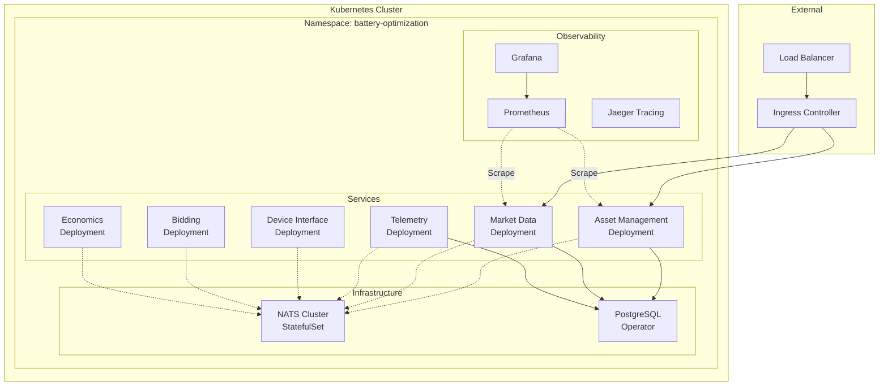

# System Architecture

## High-Level Service Architecture

## Service Boundaries (Domain-Driven Design)

## Event Flow: Charging Scenario

## Event Flow: FCAS Dispatch

## Data Flow: DB-per-Service Pattern

**Key Principle**: No direct database access between services. All communication via events.

## Technology Stack

| Layer | Technology | Purpose |
|-------|-----------|---------|
| **Language** | Go 1.23 | Service implementation |
| **Event Bus** | NATS 2.10 | Asynchronous messaging |
| **Database** | PostgreSQL 18 | Per-service data storage |
| **Containers** | Docker + Docker Compose | Local development |
| **Orchestration** | Kubernetes (future) | Production deployment |
| **Observability** | Prometheus + Grafana (future) | Metrics and monitoring |
| **Testing** | Go testing + testify | Unit and integration tests |

## Design Patterns Applied

### 1. Domain-Driven Design (DDD)
- **Bounded Contexts**: Each service owns its domain
- **Aggregates**: Battery, Price, Contract
- **Repositories**: Abstract data access
- **Domain Events**: First-class communication mechanism

### 2. Event-Driven Architecture
- **Event Sourcing**: State changes captured as events
- **Eventual Consistency**: Services update asynchronously
- **Outbox Pattern** (future): Reliable event publishing

### 3. Hexagonal Architecture (Ports & Adapters)
- **Ports**: Interfaces defined by domain
- **Adapters**: 
  - Primary: HTTP handlers, event subscribers
  - Secondary: Database repositories, NATS publishers

### 4. Anti-Corruption Layer
- **BatteryAdapter**: Isolate hardware-specific details
- **CustomAttributes**: Manufacturer-specific data segregation
- **Domain Model**: Clean, vendor-agnostic

## Deployment View (Future)

**Note**: Kubernetes deployment is future work. Current focus is local Docker Compose development.

## Security Considerations (Future)

- **Authentication**: JWT tokens for API access
- **Authorization**: RBAC for operator permissions
- **Secrets Management**: Kubernetes secrets or Vault
- **Network Policies**: Service-to-service communication restrictions
- **Encryption**: TLS for all communication

## Scalability Considerations

### Current (MVP - Educational Project)
- Single instance per service
- 5 microservices implemented (Asset Management, Market Data, Telemetry, Device Interface, Bidding)
- Suitable for 1-10 batteries
- Development/demo environment
- Event-driven architecture with NATS
- DB-per-service pattern (3 PostgreSQL databases)

### Future Production
- **Horizontal scaling**: Multiple service instances
- **Event partitioning**: NATS JetStream with partitioning
- **Database sharding**: Partition by battery site
- **Caching**: Redis for frequently accessed data
- **Rate limiting**: Protect against event storms

## Next Steps

See [PLANNING.md](../PLANNING.md) for current milestone progress and upcoming tasks.